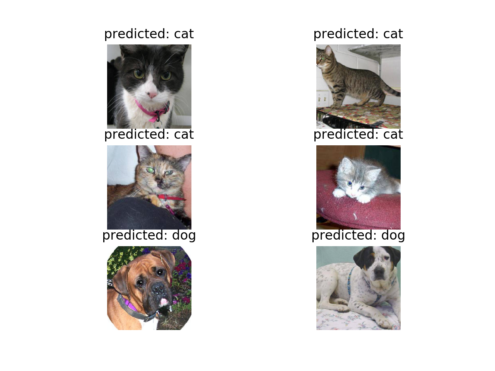
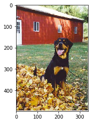
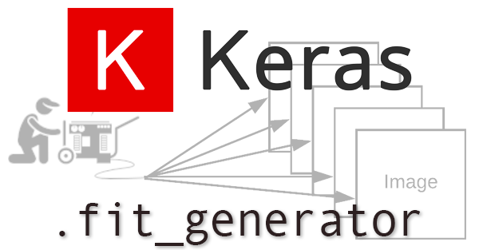

<center><h1 style="font-size:50px;">CONVOLUTIONAL NEURAL NETWORK USING KERAS</h1></center>
<br> </br>
<br> </br>
<br> </br>
<br> </br>
<br> </br>


<center><h2 style="font-size:20px;"> Haryanto (M07158031)</h2></center>

**Convolutional Neural Network (NN)** is an import branch of Artificial Intelligence and Machine Learning. NN has capability of building and training a model to identify different complicated classes, which is not achievable with conventional linear/nonlinear classifiers, such as Softmax regression, SVM, etc. In addition, we all know that NN is a super hot topic nowadays.

**Structures of (Convolutional) Neural Network**

<center></p>
    Figure 1. - Basic component in Neural Net, connection of neurons in the previous layer to one neuron inthe next layer, which is computing a dot product of their weights with the input followed by a non-linearity activation function.


<p>The layers of a ConvNet have neurons arranged   in 3 dimensions: width, height, depth. (Note that the word depth here refers to the third dimension of an activation volume, not to the depth of a full Neural Network, which can refer to the total number of layers in a network.<p> 


<center></center>
<center>Figure 2. - Simple one-hidden-layer Neural Net model. The output layer is just a linear classifier, such as softmax.</center>
<br>http://cs231n.github.io/convolutional-networks/</br>

**A convolution neural network** is similar to a multi-layer perceptron network. The major differences are what the network learns, how they are structured and what purpose they are mostly used for. Convolutional neural networks were also inspired from biological processes, their structure has a semblance of the visual cortex present in an animal. CNNs are largely applied in the domain of computer vision and has been highly successful in achieving state of the art performance on various test cases.
<center>
<center>Figure 3. - A complex Convolutional Neural Net, which is Conv layer -> pooling -> Conv layer -> pooling -> two fully-connected layer -> out prediction.</center>

<br>https://towardsdatascience.com/build-your-own-convolution-neural-network-in-5-mins-4217c2cf964f</br>

<center><h1>Example Convolutional For Clasifier Cat and Dog</h1></center>


<center>

# Import Library


```python
import numpy as np 
import pandas as pd 
from keras.preprocessing.image import ImageDataGenerator, load_img
from keras.utils import to_categorical
from sklearn.model_selection import train_test_split
import matplotlib.pyplot as plt
import random

import os
print(os.listdir("./input/"))

FAST_RUN = False
IMAGE_WIDTH=128
IMAGE_HEIGHT=128
IMAGE_SIZE=(IMAGE_WIDTH, IMAGE_HEIGHT)
IMAGE_CHANNELS=3
```

    ['train', 'test']


# Prepare Traning Data


```python
filenames = os.listdir("./input/train/train/")
categories = []
for filename in filenames:
    category = filename.split('.')[0]
    if category == 'dog':
        categories.append(1)
    else:
        categories.append(0)
  
df = pd.DataFrame({'filename' : filenames, 'category':categories}).astype(str)
```


```python

df.dtypes
```


    filename    object
    category    object
    dtype: object


<center><h1>Check Data set</h1></center>


```python
df.head()
```


<div>
<style scoped>
    .dataframe tbody tr th:only-of-type {
        vertical-align: middle;
    }

    .dataframe tbody tr th {
        vertical-align: top;
    }

    .dataframe thead th {
        text-align: right;
    }
</style>
<table border="1" class="dataframe">
  <thead>
    <tr style="text-align: right;">
      <th></th>
      <th>filename</th>
      <th>category</th>
    </tr>
  </thead>
  <tbody>
    <tr>
      <th>0</th>
      <td>cat.2793.jpg</td>
      <td>0</td>
    </tr>
    <tr>
      <th>1</th>
      <td>dog.2435.jpg</td>
      <td>1</td>
    </tr>
    <tr>
      <th>2</th>
      <td>cat.3834.jpg</td>
      <td>0</td>
    </tr>
    <tr>
      <th>3</th>
      <td>dog.2189.jpg</td>
      <td>1</td>
    </tr>
    <tr>
      <th>4</th>
      <td>cat.1871.jpg</td>
      <td>0</td>
    </tr>
  </tbody>
</table>
</div>


```python
df.tail()
```


<div>
<style scoped>
    .dataframe tbody tr th:only-of-type {
        vertical-align: middle;
    }

    .dataframe tbody tr th {
        vertical-align: top;
    }

    .dataframe thead th {
        text-align: right;
    }
</style>
<table border="1" class="dataframe">
  <thead>
    <tr style="text-align: right;">
      <th></th>
      <th>filename</th>
      <th>category</th>
    </tr>
  </thead>
  <tbody>
    <tr>
      <th>7941</th>
      <td>dog.3509.jpg</td>
      <td>1</td>
    </tr>
    <tr>
      <th>7942</th>
      <td>dog.572.jpg</td>
      <td>1</td>
    </tr>
    <tr>
      <th>7943</th>
      <td>cat.3393.jpg</td>
      <td>0</td>
    </tr>
    <tr>
      <th>7944</th>
      <td>dog.829.jpg</td>
      <td>1</td>
    </tr>
    <tr>
      <th>7945</th>
      <td>dog.2966.jpg</td>
      <td>1</td>
    </tr>
  </tbody>
</table>
</div>


<center><h1>See Total In count using Bar chart</h1></center>


```python
df['category'].value_counts().plot.bar()
```


    <matplotlib.axes._subplots.AxesSubplot at 0x7f830325ebe0>


From our data we have 4000 cats and 4000 dogs

<center><h1>See sample image</h1></center>


```python
sample = random.choice(filenames)
image = load_img("./input/train/train/"+sample)
plt.imshow(image)
```


    <matplotlib.image.AxesImage at 0x7f82cb650ef0>





<center><h1>Build Model</h1></center>

<p>The convolutional and pooling layers are followed by a dense fully connected layer that interprets the features extracted by the convolutional part of the model. A flatten layer is used between the convolutional layers and the dense layer to reduce the feature maps to a single one-dimensional vector.</p>


<br>https://machinelearningmastery.com/how-to-develop-convolutional-neural-network-models-for-time-series-forecasting/</br>


```python
from keras.models import Sequential
from keras.layers import Conv2D, MaxPooling2D, Dropout, Flatten, Dense, Activation, BatchNormalization

model = Sequential()

model.add(Conv2D(32, (3, 3), activation='relu', input_shape=(IMAGE_WIDTH, IMAGE_HEIGHT, IMAGE_CHANNELS)))
model.add(BatchNormalization())
model.add(MaxPooling2D(pool_size=(2, 2)))
model.add(Dropout(0.25))

model.add(Conv2D(64, (3, 3), activation='relu'))
model.add(BatchNormalization())
model.add(MaxPooling2D(pool_size=(2, 2)))
model.add(Dropout(0.25))

model.add(Conv2D(128, (3, 3), activation='relu'))
model.add(BatchNormalization())
model.add(MaxPooling2D(pool_size=(2, 2)))
model.add(Dropout(0.25))

model.add(Flatten())
model.add(Dense(512, activation='relu'))
model.add(BatchNormalization())
model.add(Dropout(0.5))
model.add(Dense(1, activation='sigmoid'))

model.compile(loss='binary_crossentropy', optimizer='rmsprop', metrics=['accuracy'])

model.summary()
```

    WARNING:tensorflow:From /home/vm/.conda/envs/antore/lib/python3.6/site-packages/tensorflow/python/framework/op_def_library.py:263: colocate_with (from tensorflow.python.framework.ops) is deprecated and will be removed in a future version.
    Instructions for updating:
    Colocations handled automatically by placer.
    WARNING:tensorflow:From /home/vm/.conda/envs/antore/lib/python3.6/site-packages/keras/backend/tensorflow_backend.py:3445: calling dropout (from tensorflow.python.ops.nn_ops) with keep_prob is deprecated and will be removed in a future version.
    Instructions for updating:
    Please use `rate` instead of `keep_prob`. Rate should be set to `rate = 1 - keep_prob`.
    _________________________________________________________________
    Layer (type)                 Output Shape              Param #   
    =================================================================
    conv2d_1 (Conv2D)            (None, 126, 126, 32)      896       
    _________________________________________________________________
    batch_normalization_1 (Batch (None, 126, 126, 32)      128       
    _________________________________________________________________
    max_pooling2d_1 (MaxPooling2 (None, 63, 63, 32)        0         
    _________________________________________________________________
    dropout_1 (Dropout)          (None, 63, 63, 32)        0         
    _________________________________________________________________
    conv2d_2 (Conv2D)            (None, 61, 61, 64)        18496     
    _________________________________________________________________
    batch_normalization_2 (Batch (None, 61, 61, 64)        256       
    _________________________________________________________________
    max_pooling2d_2 (MaxPooling2 (None, 30, 30, 64)        0         
    _________________________________________________________________
    dropout_2 (Dropout)          (None, 30, 30, 64)        0         
    _________________________________________________________________
    conv2d_3 (Conv2D)            (None, 28, 28, 128)       73856     
    _________________________________________________________________
    batch_normalization_3 (Batch (None, 28, 28, 128)       512       
    _________________________________________________________________
    max_pooling2d_3 (MaxPooling2 (None, 14, 14, 128)       0         
    _________________________________________________________________
    dropout_3 (Dropout)          (None, 14, 14, 128)       0         
    _________________________________________________________________
    flatten_1 (Flatten)          (None, 25088)             0         
    _________________________________________________________________
    dense_1 (Dense)              (None, 512)               12845568  
    _________________________________________________________________
    batch_normalization_4 (Batch (None, 512)               2048      
    _________________________________________________________________
    dropout_4 (Dropout)          (None, 512)               0         
    _________________________________________________________________
    dense_2 (Dense)              (None, 1)                 513       
    =================================================================
    Total params: 12,942,273
    Trainable params: 12,940,801
    Non-trainable params: 1,472
    _________________________________________________________________


<center><h1>Callbacks</h1></center>
<p>A callback is a set of functions to be applied at given stages of the training procedure. You can use callbacks to get a view on internal states and statistics of the model during training. You can pass a list of callbacks (as the keyword argument callbacks) to the .fit() method of the Sequential or Model classes. The relevant methods of the callbacks will then be called at each stage of the training.</p>

<br>https://keras.io/callbacks/</br>


```python
from keras.callbacks import EarlyStopping, ReduceLROnPlateau
```

**Early Stop**

early stop is techniq for Stop training when a monitored quantity has stopped improving. 
To prevent over fitting we will stop the learning after 10 epochs and val_loss value not decreased


```python
earlystop = EarlyStopping(patience=10)
```

**Learning Rate Reduction**
<p>Models often benefit from reducing the learning rate by a factor of **2-10 once learning stagnates**. This callback monitors a quantity and if no improvement is seen for a 'patience' number of epochs, the learning rate is reduced.</p>
<br>We will reduce the learning rate when then accuracy not increase for 2 steps</br>


```python
learning_rate_reduction = ReduceLROnPlateau(monitor='val_acc', 
                                            patience=2, 
                                            verbose=1, 
                                            factor=0.5, 
                                            min_lr=0.00001)
```


```python
callbacks = [earlystop, learning_rate_reduction]
```

<center><h1>Prepare Test and Train Data</h1></center>


```python
train_df, validate_df = train_test_split(df, test_size=0.20, random_state=42)
train_df = train_df.reset_index(drop=True)
validate_df = validate_df.reset_index(drop=True)
```


```python
train_df['category'].value_counts().plot.bar()
```


    <matplotlib.axes._subplots.AxesSubplot at 0x7f83033e6a90>


```python
validate_df['category'].value_counts().plot.bar()
```


    <matplotlib.axes._subplots.AxesSubplot at 0x7f82f874a0f0>


```python
total_train = train_df.shape[0]
total_validate = validate_df.shape[0]
batch_size=15
```

<center><h1> Traning Generator</h1></center>


```python
train_datagen = ImageDataGenerator(
    rotation_range=15,
    rescale=1./255,
    shear_range=0.1,
    zoom_range=0.2,
    horizontal_flip=True,
    width_shift_range=0.1,
    height_shift_range=0.1
)

train_generator = train_datagen.flow_from_dataframe(
    train_df, 
    "input/train/train/", 
    x_col='filename',
    y_col='category',
    target_size=IMAGE_SIZE,
    class_mode='binary',
    batch_size=batch_size
)
```

    Found 6355 images belonging to 2 classes.


<center><h1> Validation Generator</h1><c/enter>


```python
validation_datagen = ImageDataGenerator(rescale=1./255)
validation_generator = validation_datagen.flow_from_dataframe(
    validate_df, 
    "input/train/train/", 
    x_col='filename',
    y_col='category',
    target_size=IMAGE_SIZE,
    class_mode='binary',
    batch_size=batch_size
)
```

    Found 1590 images belonging to 2 classes.


<center><h1> Fit Model</h1><c/enter>

<br></br>
The Keras utility we use for this purpose is  *ImageDataGenerator*.

*from keras.preprocessing.image import ImageDataGenerator*

This function works by flipping, rescaling, zooming, and shearing the images. The first argument rescale ensures the images are rescaled to have pixel values between zero and one. horizontal_flip=True means that the images will be flipped horizontally. All these actions are part of the image augmentation.
<center>

<br>https://heartbeat.fritz.ai/a-beginners-guide-to-convolutional-neural-networks-cnn-cf26c5ee17ed</br>


```python
epochs=3 if FAST_RUN else 50
history = model.fit_generator(
    train_generator, 
    epochs=epochs,
    validation_data=validation_generator,
    validation_steps=total_validate//batch_size,
    steps_per_epoch=total_train//batch_size,
    callbacks=callbacks
)
```

    WARNING:tensorflow:From /home/vm/.conda/envs/antore/lib/python3.6/site-packages/tensorflow/python/ops/math_ops.py:3066: to_int32 (from tensorflow.python.ops.math_ops) is deprecated and will be removed in a future version.
    Instructions for updating:
    Use tf.cast instead.
    Epoch 1/50
    423/423 [==============================] - 317s 750ms/step - loss: 0.8582 - acc: 0.5806 - val_loss: 0.9945 - val_acc: 0.5509
    Epoch 2/50
    423/423 [==============================] - 311s 736ms/step - loss: 0.6643 - acc: 0.6485 - val_loss: 0.5949 - val_acc: 0.6836
    Epoch 3/50
    423/423 [==============================] - 314s 741ms/step - loss: 0.5934 - acc: 0.6865 - val_loss: 0.5984 - val_acc: 0.6711
    Epoch 4/50
    423/423 [==============================] - 310s 733ms/step - loss: 0.5558 - acc: 0.7167 - val_loss: 0.6006 - val_acc: 0.6887
    Epoch 5/50
    423/423 [==============================] - 314s 743ms/step - loss: 0.5255 - acc: 0.7313 - val_loss: 0.5024 - val_acc: 0.7579
    Epoch 6/50
    423/423 [==============================] - 314s 742ms/step - loss: 0.5043 - acc: 0.7593 - val_loss: 0.7188 - val_acc: 0.6755
    Epoch 7/50
    423/423 [==============================] - 319s 755ms/step - loss: 0.4709 - acc: 0.7794 - val_loss: 0.4692 - val_acc: 0.7799
    Epoch 8/50
    423/423 [==============================] - 320s 757ms/step - loss: 0.4769 - acc: 0.7693 - val_loss: 0.4147 - val_acc: 0.8176
    Epoch 9/50
    423/423 [==============================] - 304s 719ms/step - loss: 0.4621 - acc: 0.7872 - val_loss: 0.4704 - val_acc: 0.7774
    Epoch 10/50
    423/423 [==============================] - 292s 690ms/step - loss: 0.4453 - acc: 0.7974 - val_loss: 0.4707 - val_acc: 0.8006
    
    Epoch 00010: ReduceLROnPlateau reducing learning rate to 0.0005000000237487257.
    Epoch 11/50
    423/423 [==============================] - 293s 692ms/step - loss: 0.4029 - acc: 0.8177 - val_loss: 0.3655 - val_acc: 0.8428
    Epoch 12/50
    423/423 [==============================] - 309s 731ms/step - loss: 0.3883 - acc: 0.8232 - val_loss: 0.3557 - val_acc: 0.8509
    Epoch 13/50
    423/423 [==============================] - 293s 694ms/step - loss: 0.3812 - acc: 0.8306 - val_loss: 0.4262 - val_acc: 0.8220
    Epoch 14/50
    423/423 [==============================] - 290s 686ms/step - loss: 0.3797 - acc: 0.8343 - val_loss: 0.3873 - val_acc: 0.8270
    
    Epoch 00014: ReduceLROnPlateau reducing learning rate to 0.0002500000118743628.
    Epoch 15/50
    423/423 [==============================] - 286s 676ms/step - loss: 0.3553 - acc: 0.8436 - val_loss: 0.6320 - val_acc: 0.7717
    Epoch 16/50
    423/423 [==============================] - 285s 674ms/step - loss: 0.3580 - acc: 0.8367 - val_loss: 0.3131 - val_acc: 0.8686
    Epoch 17/50
    423/423 [==============================] - 285s 674ms/step - loss: 0.3493 - acc: 0.8456 - val_loss: 0.3284 - val_acc: 0.8547
    Epoch 18/50
    423/423 [==============================] - 285s 673ms/step - loss: 0.3443 - acc: 0.8513 - val_loss: 0.3413 - val_acc: 0.8541
    
    Epoch 00018: ReduceLROnPlateau reducing learning rate to 0.0001250000059371814.
    Epoch 19/50
    423/423 [==============================] - 285s 673ms/step - loss: 0.3274 - acc: 0.8655 - val_loss: 0.3154 - val_acc: 0.8723
    Epoch 20/50
    423/423 [==============================] - 285s 673ms/step - loss: 0.3207 - acc: 0.8625 - val_loss: 0.3393 - val_acc: 0.8566
    Epoch 21/50
    423/423 [==============================] - 284s 672ms/step - loss: 0.3201 - acc: 0.8585 - val_loss: 0.3227 - val_acc: 0.8579
    
    Epoch 00021: ReduceLROnPlateau reducing learning rate to 6.25000029685907e-05.
    Epoch 22/50
    423/423 [==============================] - 285s 674ms/step - loss: 0.3228 - acc: 0.8626 - val_loss: 0.3053 - val_acc: 0.8679
    Epoch 23/50
    423/423 [==============================] - 285s 674ms/step - loss: 0.3234 - acc: 0.8575 - val_loss: 0.3050 - val_acc: 0.8711
    
    Epoch 00023: ReduceLROnPlateau reducing learning rate to 3.125000148429535e-05.
    Epoch 24/50
    423/423 [==============================] - 286s 675ms/step - loss: 0.3145 - acc: 0.8665 - val_loss: 0.2976 - val_acc: 0.8686
    Epoch 25/50
    423/423 [==============================] - 285s 673ms/step - loss: 0.3092 - acc: 0.8694 - val_loss: 0.3057 - val_acc: 0.8742
    Epoch 26/50
    423/423 [==============================] - 285s 673ms/step - loss: 0.3149 - acc: 0.8619 - val_loss: 0.3070 - val_acc: 0.8686
    Epoch 27/50
    423/423 [==============================] - 285s 673ms/step - loss: 0.3086 - acc: 0.8696 - val_loss: 0.3212 - val_acc: 0.8642
    
    Epoch 00027: ReduceLROnPlateau reducing learning rate to 1.5625000742147677e-05.
    Epoch 28/50
    423/423 [==============================] - 285s 673ms/step - loss: 0.3020 - acc: 0.8691 - val_loss: 0.2938 - val_acc: 0.8780
    Epoch 29/50
    423/423 [==============================] - 284s 672ms/step - loss: 0.2989 - acc: 0.8689 - val_loss: 0.2979 - val_acc: 0.8736
    Epoch 30/50
    423/423 [==============================] - 285s 674ms/step - loss: 0.3104 - acc: 0.8664 - val_loss: 0.3013 - val_acc: 0.8742
    
    Epoch 00030: ReduceLROnPlateau reducing learning rate to 1e-05.
    Epoch 31/50
    423/423 [==============================] - 285s 673ms/step - loss: 0.3063 - acc: 0.8709 - val_loss: 0.3081 - val_acc: 0.8692
    Epoch 32/50
    423/423 [==============================] - 285s 674ms/step - loss: 0.3187 - acc: 0.8615 - val_loss: 0.3032 - val_acc: 0.8730
    Epoch 33/50
    423/423 [==============================] - 286s 675ms/step - loss: 0.3064 - acc: 0.8689 - val_loss: 0.3069 - val_acc: 0.8686
    Epoch 34/50
    423/423 [==============================] - 285s 673ms/step - loss: 0.3119 - acc: 0.8611 - val_loss: 0.3119 - val_acc: 0.8654
    Epoch 35/50
    423/423 [==============================] - 285s 674ms/step - loss: 0.2951 - acc: 0.8768 - val_loss: 0.3056 - val_acc: 0.8704
    Epoch 36/50
    423/423 [==============================] - 284s 672ms/step - loss: 0.3019 - acc: 0.8682 - val_loss: 0.3052 - val_acc: 0.8723
    Epoch 37/50
    423/423 [==============================] - 285s 673ms/step - loss: 0.3035 - acc: 0.8719 - val_loss: 0.3014 - val_acc: 0.8742
    Epoch 38/50
    423/423 [==============================] - 285s 673ms/step - loss: 0.3123 - acc: 0.8622 - val_loss: 0.3022 - val_acc: 0.8736


<center><h1> Save Model</h1></center>


```python
model.save_weights("model.h5")
```

<center><h1>Virtualize Training</h1></center>


```python
fig, (ax1, ax2) = plt.subplots(2, 1, figsize=(12, 12))
ax1.plot(history.history['loss'], color='b', label="Training loss")
ax1.plot(history.history['val_loss'], color='r', label="validation loss")
ax1.set_xticks(np.arange(1, epochs, 1))
ax1.set_yticks(np.arange(0, 1, 0.1))

ax2.plot(history.history['acc'], color='b', label="Training accuracy")
ax2.plot(history.history['val_acc'], color='r',label="Validation accuracy")
ax2.set_xticks(np.arange(1, epochs, 1))

legend = plt.legend(loc='best', shadow=True)
plt.tight_layout()
plt.show()
```


<center><h1>Prepare Testing Data</h1></center>


```python
test_filenames = os.listdir("./input/test/")
test_df = pd.DataFrame({
    'filename': test_filenames
})
nb_samples = test_df.shape[0]
```

<center><h1>Create Testing Generator</h1></center>


```python
test_gen = ImageDataGenerator(rescale=1./255)
test_generator = test_gen.flow_from_dataframe(
    test_df, 
    "./input/test/", 
    x_col='filename',
    y_col=None,
    class_mode=None,
    target_size=IMAGE_SIZE,
    batch_size=batch_size,
    shuffle=False
)
```

    Found 60 images.


<center><h1> Predict</h1></center>


```python
predict = model.predict_generator(test_generator, steps=np.ceil(nb_samples/batch_size))
```

As predicted of binary classification result return probability that image likely to be a dog. So we will have threshold 0.5 which mean if predicted value more than 50% it is a dog and under 50% will be a cat.


```python
threshold = 0.5
test_df['probability'] = predict
test_df['category'] = np.where(test_df['probability'] > threshold, 1,0)
```

<center><h1>Virtaulize Result</h1><center>


```python
test_df['category'].value_counts().plot.bar()
```


    <matplotlib.axes._subplots.AxesSubplot at 0x7f82e84c6828>


<center><h1> See predicted result with images</h1></center>


```python
sample_test = test_df.head(10)
sample_test.head()
plt.figure(figsize=(12, 24))
for index, row in sample_test.iterrows():
    filename = row['filename']
    category = row['category']
    probability = row['probability']
    img = load_img("./input/test/"+filename, target_size=IMAGE_SIZE)
    plt.subplot(6, 5, index+1)
    plt.imshow(img)
    plt.xlabel(filename + '(' + "{}".format(category) + ')' '(' + "{}".format(round(probability, 2)) + ')')
plt.tight_layout()
plt.show()
```


<center><h1> Submission</h1></center>


```python
submission_df = test_df.copy()
submission_df['id'] = submission_df['filename'].str.split('.').str[0]
submission_df['label'] = submission_df['category']
submission_df.drop(['filename', 'category'], axis=1, inplace=True)
submission_df.to_csv('submission.csv', index=False)
```

<center><h1 style="font-size:50px;">Thank you for attention !!</h1></center>
